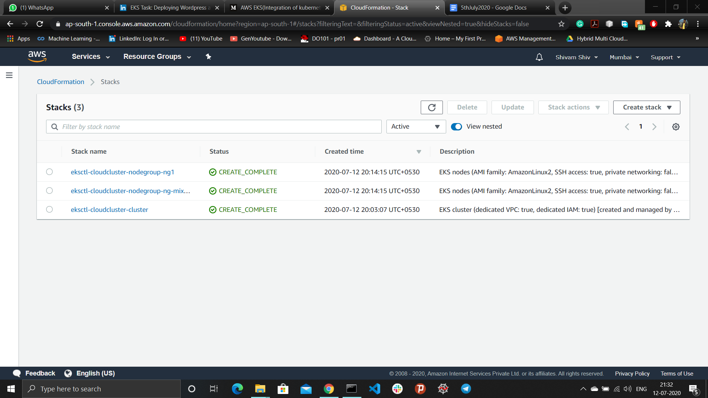

## Deploying Wordpress and MySQL on AWS EKS Cluster
*Creating Kubernetes cluster using AWS-EKS integrating with EC2 instances(master/control_plane and slave/worker), ELB(Elastic load Balancer), EFS(Elastic File System) and other aws services. Then deploying Wordpress(frontend) and MySQL(backend) images on different pod/environment(Operating System) on EKS Cluster integrating with ELB to provide load balancing, EFS to provide persistent volume/storage to the pod.*

### AWS EKS
- Amazon EKS (Elastic Kubernetes Service) is a managed Kubernetes service that allows you to run Kubernetes on AWS without the hassle of managing the Kubernetes control plane. 
- EKS is a managed containers-as-a-service (CaaS) that drastically simplifies Kubernetes deployment on AWS. 
- The big benefit of EKS, and other similar hosted Kubernetes services, is taking away the operational burden involved in running this control plane. You deploy cluster worker nodes using defined AMIs and with the help of CloudFormation, and EKS will provision, scale and manage the Kubernetes control plane for you to ensure high availability, security and scalability.

## Amazon EKS: Two Main Components
- **Control Plane:** The Control Plane consists of differnt Kubernetes master nodes that run in different availability zones (AZs). All incoming traffic to Kubernetes API comes through the network load balancer (NLB). It runs on the virtual private cloud controlled by Amazon. Hence, the Control Panel can’t be managed directly by the organization and is fully managed by AWS.
- **Worker Nodes:** Worner Nodes run on the Amazon EC2 instances in the virtual private cloud controlled by the organization. Any instance in AWS can be used as a worker node. These worker nodes can be accessed through SSH or provisioned without automation.

## Kubernetes
- Kubernetes is an open-source system that allows organizations to deploy and manage containerized applications like platforms as a service (PaaS), batch processing workers, and microservices in the cloud at scale. Through an abstraction layer created on top of a group of hosts, development teams can let Kubernetes manage a host of functions--including load balancing, monitoring and controlling resource consumption by team or application, limiting resource consumption and leveraging additional resources from new hosts added to a cluster, and other workflows.
- Through Amazon EKS, organizations using AWS can get the full functions of Kubernetes without having to install or manage Kubernetes itself.

## AWS EKS Workflow
- AWS EKS(discussed above)
- AWS Fargate is a technology that provides on-demand, right-sized compute capacity for containers. With AWS Fargate, you no longer have to provision, configure, or scale groups of virtual machines to run containers. This removes the need to choose server types, decide when to scale your node groups, or optimize cluster packing. Using Fargate, customers define and pay for resources at the pod-level. This makes it easy to right-size resource utilization for each application and allow customers to clearly see the cost of each pod.


We can access AWS-EKS service from the Web-UI or CLI(command line interface). Here, I used CLI to access EKS with the help of EKSCTL software.
#### Installation of EKSCTL
Eksctl is a simple CLI tool for creating clusters on EKS - Amazon's new managed Kubernetes service for EC2.
- Set the path of eksctl in the system after installation.
<https://github.com/weaveworks/eksctl/releases/download/0.23.0/eksctl_Windows_amd64.zip>

### Pre-requisite setup
- Create an IAM user and provide required permissions(default root)
- Create a key-pairs to login to the launched worker node in future(save the key file and change it to extension .pem)
- Configure kubectl in the system from the given [link](https://kubernetes.io/docs/tasks/tools/install-kubectl/).
- Configure the CLI for the user by providing user credentials(Access key ID, Secret access key) 
```
aws configure
```

### Step to achieve the Wordpress-MySQL EKS configuration:
**Step 1:** Create EKS cluster using cluster.yml file in which further information about the cluster is defined.
- Name of the cluster
- Region of the cluster
- Nodegroups
- Type of instances
- Key Name
```
apiVersion: eksctl.io/v1alpha5
kind: ClusterConfig

metadata:
  name: cloudcluster
  region: ap-south-1

nodeGroups:
   - name: ng1
     desiredCapacity: 2
     instanceType: t2.micro
     ssh:
        publicKeyName: lwindia
   - name: ng-mixed
     minSize: 2
     maxSize: 5
     instancesDistribution:
       maxPrice: 0.017
       instanceTypes: ["t3.small","t3.medium"] # At least one instance type should be specified
       onDemandBaseCapacity: 0
       onDemandPercentageAboveBaseCapacity: 50
       spotInstancePools: 2     
     ssh:
         publicKeyName: lwindia
```
Run the following command from the CLI of the system 
```
eksctl create cluster -f cluster.yml
```
After creating the cluster successfully the CLI output appears as-


EKS Cluster launches four nodes as per specified in the cluster file.


Now, update the config file such that kubectl can easily access the cluster
```
aws eks update-kubeconfig --name cloudcluster
```
One can get the updated configuration of the config file and cluster information from
 ```
 kubectl config view
 kubectl cluster-info
 ```


Eksctl also uses Cloud formation behind the scene to create the cluster and required services automatically.



EKS Cluster also creates VPC, Subnet, Security-Groups, EIP(Elastic IP) and other services.


Create the seperate namespace to deploy the cluster.
```
kubectl create ns owncloud
```
To list all the namespaces
```
kubectl get ns
```


**Step 2:** Create an EFS storage in the VPC created by the cloudcluster
- EFS provide persistent volume to the pods.
- After successfully creating EFS, install the "amazon-efs-utils" software in all the worker nodes.
```
sudo yum install amazon-efs-utils -y
```


Some important information of created EFS
- Owner ID
- DNS Name


Now, creating EFS-provisioner
- The efs-provisioner allows you to mount EFS storage as PersistentVolumes in kubernetes. It consists of a container that has access to an AWS EFS resource. The container reads a configmap which contains the EFS filesystem ID, the AWS region and the name you want to use for your efs-provisioner. This name will be used later when you create a storage class.
```
kind: Deployment
apiVersion: apps/v1
metadata:
  name: efs-provisioner
spec:
  selector:
    matchLabels:
      app: efs-provisioner
  replicas: 1
  strategy:
    type: Recreate
  template:
    metadata:
      labels:
        app: efs-provisioner
    spec:
      containers:
        - name: efs-provisioner
          image: quay.io/external_storage/efs-provisioner:v0.1.0
          env:
            - name: FILE_SYSTEM_ID
              value: fs-162fa5c7
            - name: AWS_REGION
              value: ap-south-1
            - name: PROVISIONER_NAME
              value: eks-prov/aws-efs
          volumeMounts:
            - name: pv-volume
              mountPath: /persistentvolumes
      volumes:
        - name: pv-volume
          nfs:
            server: fs-162fa5c7.efs.ap-south-1.amazonaws.com
            path: /
```
Run the following command from the CLI of the system
```
kubectl create -f create-efs-provisioner.yaml -n owncloud
```
**Step 3:** Creating RBAC file.
- Role-based access control (RBAC) is a method of restricting network access based on the roles of individual users within an enterprise. RBAC lets employees have access rights only to the information they need to do their jobs and prevents them from accessing information that doesn't pertain to them.
- RBAC authorization uses the rbac.authorization.k8s.io API group to drive authorization decisions, allowing you to dynamically configure policies through the Kubernetes API.
```
---
apiVersion: rbac.authorization.k8s.io/v1beta1
kind: ClusterRoleBinding
metadata:
  name: nfs-provisioner-role-binding
subjects:
  - kind: ServiceAccount
    name: default
    namespace: owncloud
roleRef:
  kind: ClusterRole
  name: cluster-admin
  apiGroup: rbac.authorization.k8s.io
```
Run the following command from the CLI of the system
```
kubectl create -f create-rbac.yaml -n owncloud
```
**Step 4:** Creating presistent volume for the pod. Incase if pod got deleted, data will be safe.
```
kind: StorageClass
apiVersion: storage.k8s.io/v1
metadata:
  name: aws-efs
provisioner: eks-prov/aws-efs
---
kind: PersistentVolumeClaim
apiVersion: v1
metadata:
  name: efs-wordpress
  annotations:
    volume.beta.kubernetes.io/storage-class: "aws-efs"
spec:
  accessModes:
    - ReadWriteMany
  resources:
    requests:
      storage: 10Gi
---
kind: PersistentVolumeClaim
apiVersion: v1
metadata:
  name: efs-mysql
  annotations:
    volume.beta.kubernetes.io/storage-class: "aws-efs"
spec:
  accessModes:
    - ReadWriteMany
  resources:
    requests:
      storage: 10Gi
```
Run the following command from the CLI of the system
```
kubectl create -f create-storage.yaml -n owncloud
```
**Step 5:** Create MySQL Deployment file
- This file will launch the MySQL image in a separate pod to store data in the backend which is connected to the wordpress. 
```
apiVersion: v1
kind: Service
metadata:
  name: wordpress-mysql
  labels:
    app: wordpress
spec:
  ports:
    - port: 3306
  selector:
    app: wordpress
    tier: mysql
  clusterIP: None
---
apiVersion: apps/v1 # for versions before 1.9.0 use apps/v1beta2
kind: Deployment
metadata:
  name: wordpress-mysql
  labels:
    app: wordpress
spec:
  selector:
    matchLabels:
      app: wordpress
      tier: mysql
  strategy:
    type: Recreate
  template:
    metadata:
      labels:
        app: wordpress
        tier: mysql
    spec:
      containers:
      - image: mysql:5.6
        name: mysql
        env:
        - name: MYSQL_ROOT_PASSWORD
          valueFrom:
            secretKeyRef:
              name: mysql-pass
              key: password
        ports:
        - containerPort: 3306
          name: mysql
        volumeMounts:
        - name: mysql-persistent-storage
          mountPath: /var/lib/mysql
      volumes:
      - name: mysql-persistent-storage
        persistentVolumeClaim:
          claimName: efs-mysql
```
**Step 6:** Creating Wordpress Deployment file
- This will launch the wordpress image in a separate pod. A Load Balancer service will be also created by ELB. Finally, the end user will interact to the exposed website.
```
apiVersion: v1
kind: Service
metadata:
  name: wordpress
  labels:
    app: wordpress
spec:
  ports:
    - port: 80
  selector:
    app: wordpress
    tier: frontend
  type: LoadBalancer
---
apiVersion: apps/v1 # for versions before 1.9.0 use apps/v1beta2
kind: Deployment
metadata:
  name: wordpress
  labels:
    app: wordpress
spec:
  selector:
    matchLabels:
      app: wordpress
      tier: frontend
  strategy:
    type: Recreate
  template:
    metadata:
      labels:
        app: wordpress
        tier: frontend
    spec:
      containers:
      - image: wordpress:4.8-apache
        name: wordpress
        env:
        - name: WORDPRESS_DB_HOST
          value: wordpress-mysql
        - name: WORDPRESS_DB_PASSWORD
          valueFrom:
            secretKeyRef:
              name: mysql-pass
              key: password
        ports:
        - containerPort: 80
          name: wordpress
        volumeMounts:
        - name: wordpress-persistent-storage
          mountPath: /var/www/html
      volumes:
      - name: wordpress-persistent-storage
        persistentVolumeClaim:
          claimName: efs-wordpress
``` 
**Step 7:** Create a Kustomization file with providing some secret environmental variable which will be used by the Wordpress and MySQL and are confidential. Also, provide the Wordpress and MySQL deployment resources to the file.
```
apiVersion: kustomize.config.k8s.io/v1beta1
kind: Kustomization
secretGenerator:
- name: mysql-pass
  literals:
  - password=redhat
resources:
  - deploy-mysql.yaml
  - deploy-wordpress.yaml
```
Run the following command from the CLI of the system
```
kubectl apply -k . -n owncloud
```


Load-Balancer launch by the Wordpress-deployment


Description of the services created by the deployment file


**Step 8:** Now launch the wordpress from the DNS Name provided by the load-balancer and setup the wordpress environment.


A blog created on the wordpress


### EKS Cluster successfully configured.

Lastly, I want to thanks to the Vimal Daga Sir for detailed knowledge about AWS-EKS. Also thanking to all the IIEC community group members who are constantly helping knowingly or unlnowlingly.
